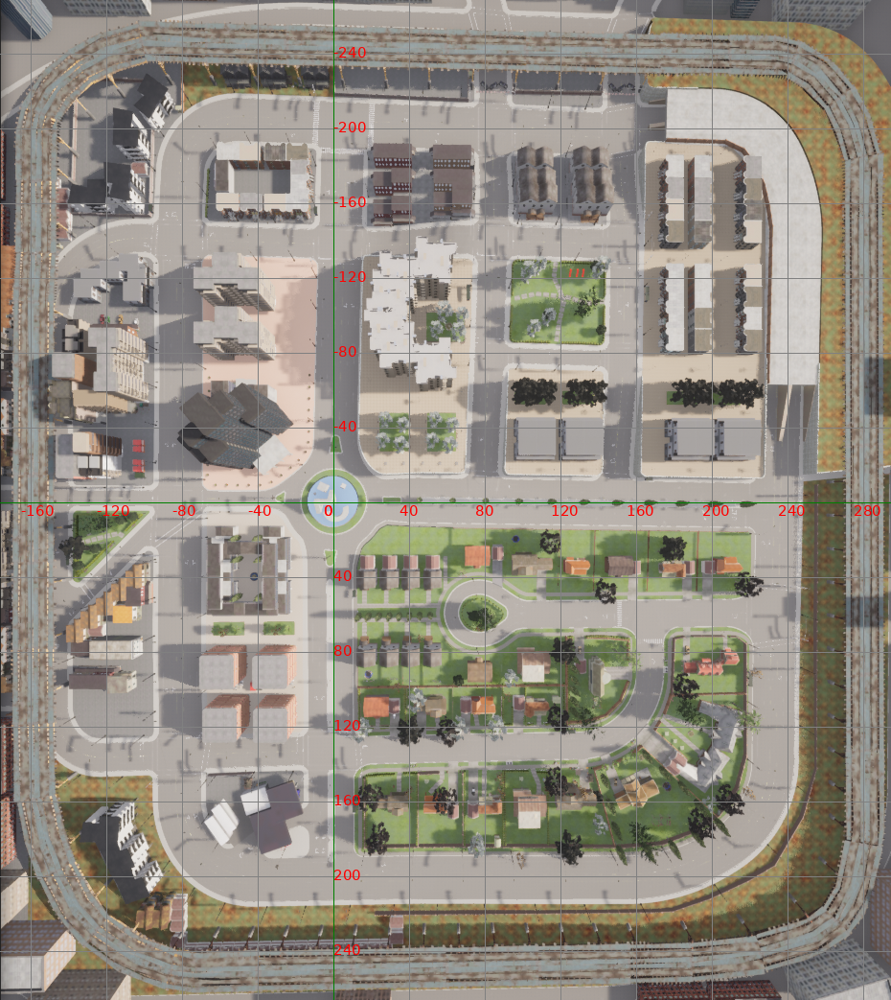

# 程序简介

## 效果展示

## 程序目的
carla地图的俯视坐标系
可将carla世界的三维坐标转换为俯视地图上的二维坐标。
可以将汽车在carla世界的连续坐标，投射到俯视地图中，获得汽车轨迹的直观表述。

## 程序运行顺序

### 1. 启动carla1客户端
./CarlaUE4.sh
### 2. 运行Carla_points.py
加载carla地图，设置俯视观察视角，可选是否卸载地图除路网外的其他元素，在carla世界中生成原点和随机点，在carla世界中将其绘制出来，并将carla世界三维点坐标保存到carla_points2.txt中
此时还需截图当前carla俯视图，应包含carla整个世界，其中一个包含绘制点，一个不包含，注意两个截图大小位置应完全相同，保存为carla_town03_allmap_points.png,carla_town03_allmap.png两个文件
### 3.运行img_points.py
读取carla_town03_allmap_points.png文件，依照上面carla世界点的位置，左键标记所有绘制点，此时得到carla世界点坐标对应的像素坐标，保存到Img_lable2.txt中
### 4.运行Calculate_translation_matrix.py
读取carla_points2.txt和Img_lable2.txt，计算出carla世界点坐标和像素点坐标之间的转换矩阵
将旋转、缩放、平移矩阵和总的变换矩阵保存到translation_matrix.txt中
test_carla2img_list方法测试其他点，验证误差
test_carla2img方法计算carla世界原点坐标对应像素原点坐标，并计算carla世界坐标点距离差和像素点坐标距离差的对应比例
### 5. 运行Carla_coordinate_draw.py
将第二步得到的carla_town03_allmap.png
第四步得到的像素原点坐标，carla世界坐标点距离差和像素点坐标距离差的对应比例
提供给create_grid_on_image绘制方法，并给定输出位置
会生一张carla世界俯视二维坐标系

